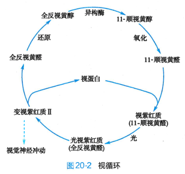

# 维生素A

### 维生素种类
> 按照可溶性，维生素分为脂溶性维生素和水溶性维生素。
脂溶性维生素包括维生素A、D、E、K；水溶性维生素包括维生素B、C和硫辛酸。

### 维生素A
1. 来源：动物性食品中，肝、肉类、蛋黄、乳制品和鱼肝油都是维生素A的丰富来源；植物中并没有维生素A，但有维生素A原（胡萝卜素），可通过人体代谢生成维生素A。
2. 维生素的吸收：维生素A在小肠被吸收。
3. 维生素A的作用：
	> 视黄醇、视黄醛和视黄酸是维生素A的活性形式。
	* 视黄醇与视蛋白的结合维持了正常的视觉功能（特别是弱光环境）。
		
	* 视黄酸可调节某些基因的表达，对人体的生长发育有着重要的作用，同时视黄酸对维持上皮组织的正常形态与生长有着重要的作用，因此可用来治疗银屑病。
	* 维生素A和胡萝卜素是有效的抗氧化剂。
	* 维生素A及其衍生物可抑制肿瘤生长。
4. 维生素A缺乏与过量：
	* 缺乏：维生素缺乏可导致夜盲症和干眼病，夜盲症的原因与视紫红质合成减少有关；干眼病与缺乏维生素后上皮严重角化有关，眼结膜发生角化，分泌细胞丢失，引起角膜干燥。
	* 过量：头痛、恶心等中枢神经系统表现；肝细胞损伤和高脂血症；钙稳态失调；皮肤干燥、脱屑等皮肤表现。